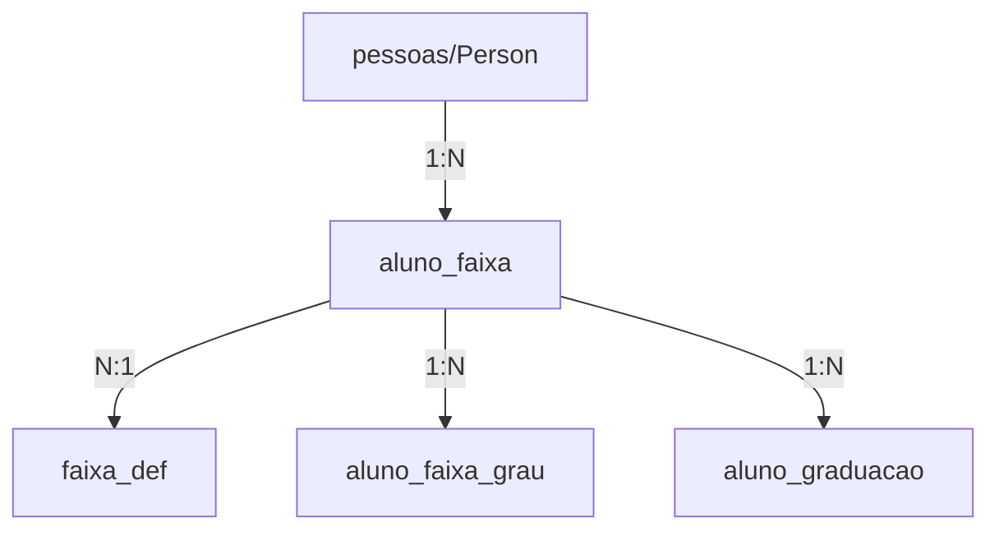

# 📊 Estrutura do Sistema de Graduação

## 🗄️ Fonte de Dados

### **SIM, o sistema busca dados da tabela `pessoas` (Person)**

O sistema de graduação está totalmente integrado com a tabela existente de pessoas/alunos. Veja como funciona:

## 🔗 Relacionamento entre Tabelas



### Tabelas Principais:

1. **`pessoas` (Person Entity)**
   - Tabela original do sistema
   - Contém todos os dados dos alunos
   - Campos importantes:
     - `id`: UUID do aluno
     - `nome_completo`: Nome do aluno
     - `faixa_atual`: Código da faixa (mantido para compatibilidade)
     - `grau_atual`: Quantidade de graus (mantido para compatibilidade)
     - `tipo_cadastro`: ALUNO/PROFESSOR/etc
     - `status`: ATIVO/INATIVO
     - `unidade_id`: ID da unidade

2. **`aluno_faixa`**
   - Nova tabela de graduação
   - Relaciona aluno com sua faixa atual
   - Campos importantes:
     - `aluno_id`: FK para `pessoas.id`
     - `faixa_def_id`: FK para definição da faixa
     - `graus_atual`: Graus atuais na faixa
     - `presencas_no_ciclo`: Presenças desde o último grau
     - `presencas_total_fx`: Total de presenças na faixa
     - `ativa`: Se é a faixa atual do aluno

3. **`faixa_def`**
   - Definições das faixas (Branca, Azul, Roxa, etc)
   - Configurações de graduação
   - Campos:
     - `aulas_por_grau`: Quantas aulas para ganhar grau
     - `graus_max`: Máximo de graus na faixa (geralmente 4)
     - `categoria`: ADULTO/INFANTIL

## 📋 Como o Sistema Funciona

### 1. **Busca de Dados (getProximosGraduar)**

```typescript
// O serviço busca dados assim:
const query = this.alunoFaixaRepository
  .createQueryBuilder('af')
  .innerJoinAndSelect('af.faixaDef', 'fd')
  .innerJoinAndSelect('af.aluno', 'a')  // <-- JOIN com tabela pessoas
  .where('af.ativa = :ativa', { ativa: true })
  .andWhere('a.tipo_cadastro = :tipo', { tipo: 'ALUNO' })
  .andWhere('a.status = :status', { status: 'ATIVO' });
```

### 2. **Dados Retornados**

O sistema retorna informações combinadas:
- Da tabela `pessoas`: nome, unidade, status
- Da tabela `aluno_faixa`: graus atuais, presenças
- Da tabela `faixa_def`: configurações da faixa

### 3. **Integração com Presenças**

Quando um aluno marca presença:
1. Sistema registra a presença normalmente
2. Chama `incrementarPresenca()` no serviço de graduação
3. Incrementa `presencas_no_ciclo` e `presencas_total_fx`
4. Se atingiu o número de aulas necessárias, concede grau automaticamente

## 🔄 Sincronização de Dados

O sistema mantém sincronização entre:
- **Tabela nova** (`aluno_faixa`): Fonte principal de verdade
- **Tabela antiga** (`pessoas`): Campos `faixa_atual` e `grau_atual` atualizados para compatibilidade

### Migração Automática

A migração `1757100200000-MigrarDadosAlunosExistentes.ts`:
1. Lê todos os alunos da tabela `pessoas`
2. Cria registros em `aluno_faixa` baseados em `faixa_atual` e `grau_atual`
3. Mantém compatibilidade total com sistema existente

## 🎯 Fluxo de Dados Completo

```
1. Frontend faz requisição GET /api/graduacao/proximos-graduar
                     ↓
2. Backend consulta tabela aluno_faixa com JOIN em pessoas
                     ↓
3. Retorna dados combinados (nome do aluno + info de graduação)
                     ↓
4. Frontend exibe na tela com nome, faixa, graus e aulas faltantes
```

## ✅ Vantagens desta Arquitetura

1. **Não duplica dados**: Usa a tabela `pessoas` existente
2. **Compatibilidade**: Mantém campos antigos funcionando
3. **Flexibilidade**: Sistema de graduação separado e extensível
4. **Histórico**: Mantém registro de todas as graduações
5. **Automação**: Graus concedidos automaticamente por presença

## 🔍 Queries Importantes

### Buscar alunos próximos a graduar:
```sql
SELECT 
  p.nome_completo,
  p.unidade_id,
  af.graus_atual,
  af.presencas_no_ciclo,
  fd.nome_exibicao as faixa,
  fd.aulas_por_grau - af.presencas_no_ciclo as faltam_aulas
FROM aluno_faixa af
JOIN pessoas p ON p.id = af.aluno_id
JOIN faixa_def fd ON fd.id = af.faixa_def_id
WHERE 
  af.ativa = true
  AND p.tipo_cadastro = 'ALUNO'
  AND p.status = 'ATIVO'
ORDER BY faltam_aulas ASC;
```

## 📝 Resumo

**SIM, o sistema usa a tabela `pessoas`** como fonte principal de dados dos alunos, complementando com as novas tabelas de graduação para gerenciar faixas, graus e progressão. Isso garante que:

- Todos os alunos existentes funcionam no sistema de graduação
- Não há duplicação de dados pessoais
- Sistema mantém compatibilidade com código legado
- Graduação é totalmente integrada com presenças
