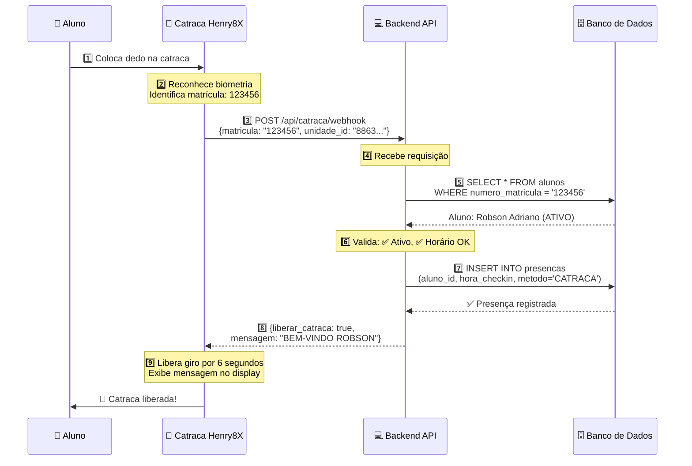

# 🚪 Integração Catraca Biométrica Henry8X

## 📋 Visão Geral

Sistema de integração para catraca biométrica com reconhecimento de digital/facial, permitindo check-in automático dos alunos quando passam pela catraca.

**Status:** ✅ Implementado e pronto para configuração

**Unidade piloto:** Team Cruz Itapevi (ID: `8863d9de-b350-4c8f-a930-726b1df3261f`)

---

## 🎯 Funcionalidades

- ✅ **Check-in automático** via reconhecimento biométrico
- ✅ **Validação de matrícula** ou CPF do aluno
- ✅ **Verificação de horário** de funcionamento
- ✅ **Controle de status** do aluno (ativo/inativo)
- ✅ **Registro de presença** no banco de dados
- ✅ **Mensagens personalizadas** no display da catraca
- ✅ **Controle de tempo** de liberação da catraca
- ✅ **Autenticação** via API Key
- ✅ **Suporte a múltiples marcas** (Henry8X, ControlID, Intelbras, etc)

---

## 🏗️ Arquitetura

### Backend (NestJS)

```
backend/src/
├── presenca/
│   ├── catraca.controller.ts    # Endpoints da API
│   ├── catraca.service.ts       # Lógica de negócio
│   └── presenca.module.ts       # Módulo atualizado
├── people/entities/
│   └── unidade.entity.ts        # + campos catraca_habilitada, catraca_config
└── migrations/
    └── 1739127600000-AddCatracaConfigToUnidades.ts
```

### Endpoints Criados

1. **POST /api/catraca/webhook** - Webhook chamado pela catraca
2. **GET /api/catraca/config/:unidade_id** - Obter configuração
3. **PUT /api/catraca/config/:unidade_id** - Atualizar configuração
4. **POST /api/catraca/test/:unidade_id** - Testar conexão

---

## ⚙️ Configuração - Passo a Passo

### 1️⃣ Rodar a Migration

```bash
cd backend
npm run typeorm migration:run
```

> Isso adiciona os campos `catraca_habilitada` e `catraca_config` na tabela `unidades`.

### 2️⃣ Configurar a Catraca via API

#### Opção A: Via HTTP Request (Postman/Insomnia)

```http
PUT http://localhost:4000/api/catraca/config/8863d9de-b350-4c8f-a930-726b1df3261f
Authorization: Bearer {seu-token-jwt}
Content-Type: application/json

{
  "habilitada": true,
  "config": {
    "tipo": "HENRY8X",
    "ip": "192.168.100.163",
    "porta": 3000,
    "modelo_placa": "Primme SF A",
    "sentido": "ANTI_HORARIO",
    "giro": "ENTRADA",
    "qtd_digitos_matricula": 6,
    "tempo_liberacao_segundos": 6,
    "modelo_biometria": "PADRAO",
    "api_key": "chave_secreta_henry8x_itapevi",
    "permite_entrada_manual": true,
    "permite_saida_automatica": false,
    "horario_funcionamento": {
      "inicio": "06:00",
      "fim": "22:00"
    }
  }
}
```

#### Opção B: Via SQL Direto

```sql
UPDATE teamcruz.unidades
SET 
  catraca_habilitada = true,
  catraca_config = '{
    "tipo": "HENRY8X",
    "ip": "192.168.100.163",
    "porta": 3000,
    "modelo_placa": "Primme SF A",
    "sentido": "ANTI_HORARIO",
    "giro": "ENTRADA",
    "qtd_digitos_matricula": 6,
    "tempo_liberacao_segundos": 6,
    "modelo_biometria": "PADRAO",
    "api_key": "chave_secreta_henry8x_itapevi",
    "permite_entrada_manual": true,
    "permite_saida_automatica": false,
    "horario_funcionamento": {
      "inicio": "06:00",
      "fim": "22:00"
    }
  }'::jsonb
WHERE id = '8863d9de-b350-4c8f-a930-726b1df3261f';
```

### 3️⃣ Verificar Configuração

```http
GET http://localhost:4000/api/catraca/config/8863d9de-b350-4c8f-a930-726b1df3261f
Authorization: Bearer {seu-token-jwt}
```

**Resposta esperada:**

```json
{
  "habilitada": true,
  "config": {
    "tipo": "HENRY8X",
    "ip": "192.168.100.163",
    "porta": 3000,
    "modelo_placa": "Primme SF A",
    ...
  }
}
```

---

## 🔌 Configurar a Catraca Henry8X

> 🚨 **ESTE PASSO É OBRIGATÓRIO!** Sem esta configuração, a catraca não vai se comunicar com nosso sistema.
> 
> **Sem webhook configurado = Sem check-in automático**

### ❓ Você vai precisar do fornecedor?

**Depende do seu nível de acesso:**

| Cenário | Precisa do fornecedor? | O que fazer |
|---------|------------------------|-------------|
| ✅ Você tem **acesso ao software** da catraca (usuário/senha admin) | ❌ **NÃO** | Seguir o passo a passo abaixo |
| ✅ Catraca tem **interface web** acessível via navegador | ❌ **NÃO** | Acessar `http://192.168.100.163:3000` |
| ⚠️ Você **não tem usuário/senha** do software | ✅ **SIM** | Solicitar acesso ao fornecedor |
| ⚠️ Software só funciona com **licença/dongle** que você não tem | ✅ **SIM** | Solicitar ao fornecedor |
| ⚠️ Configuração requer **visita técnica** | ✅ **SIM** | Agendar com fornecedor |

### 📞 Como solicitar ao fornecedor:

Se você não conseguir configurar sozinho, envie este texto ao fornecedor:

```
Olá,

Preciso configurar um WEBHOOK na catraca Henry8X modelo [MODELO] 
instalada no endereço IP 192.168.100.163.

Preciso que a catraca envie uma requisição HTTP POST para nosso 
sistema sempre que reconhecer um usuário.

Configuração necessária:
- URL Webhook: http://[IP_DO_SERVIDOR]:4000/api/catraca/webhook
- Método: POST
- Content-Type: application/json
- Dados a enviar: {"matricula": "[ID_USUARIO]", "unidade_id": "8863d9de-b350-4c8f-a930-726b1df3261f"}
- Quando enviar: Ao reconhecer biometria do usuário

Vocês conseguem fazer essa configuração remotamente ou precisa 
visita técnica?

Obrigado!
```

### 🎯 O que precisa ser feito na catraca:

A catraca Henry8X precisa ser configurada para **chamar nosso backend automaticamente** toda vez que reconhecer um aluno.

### Passo a Passo no Software da Catraca:

#### 1️⃣ Configurar Rede da Catraca

Garantir que a catraca está na rede e pode acessar nosso servidor:
- **IP da Catraca:** `192.168.100.163`
- **Porta:** `3000`
- **Testar conectividade:** A catraca deve conseguir fazer ping no servidor

#### 2️⃣ Configurar Webhook/Callback URL

No software da catraca, procure por:
- "Webhook"
- "Callback URL"
- "Evento de Reconhecimento"
- "Integração com Sistema Externo"

**Configurar:**
- **URL:** `http://192.168.1.100:4000/api/catraca/webhook` (trocar pelo IP do servidor)
- **Método:** `POST`
- **Content-Type:** `application/json`
- **Quando chamar:** "Ao reconhecer usuário" ou "Ao validar biometria"

#### 3️⃣ Configurar Dados a Enviar

A catraca deve enviar um JSON neste formato quando reconhecer alguém:

```json
{
  "matricula": "123456",
  "unidade_id": "8863d9de-b350-4c8f-a930-726b1df3261f",
  "disDois Cadastros Necessários

### 1️⃣ Cadastrar Digital na Catraca Henry8X

**Onde:** No software/equipamento da catraca  
**Como:** 
1. Acessar menu "Cadastrar Usuário" ou "Enroll"
2. Informar matrícula: `000001`
3. Pedir aluno colocar o dedo 3x
4. Catraca salva a digital vinculada à matrícula `000001`

> 💡 A matrícula usada aqui será a mesma enviada no webhook!

### 2️⃣ Cadastrar Matrícula no Nosso Sistema

**Onde:** Banco de dados  
**Como:**

```sql
-- Exemplo: Cadastrar matrícula para o aluno Robson
UPDATE teamcruz.alunos
SET numero_matricula = '000001'
WHERE nome_completo = 'Robson Adriano'
AND unidade_id = '8863d9de-b350-4c8f-a930-726b1df3261f';
```

> **Crítico:** A matrícula no nosso banco **DEVE SER IGUAL** à cadastrada na catraca!

### ✅ Validação

```sql
-- Conferir matrículas cadastradas
SELECT 
  id,
  nome_completo,
  numero_matricula,
  status,
  unidade_id
FROM teamcruz.alunos
WHERE unidade_id = '8863d9de-b350-4c8f-a930-726b1df3261f'
AND numero_matricula IS NOT NULL
ORDER BY numero_matricula;
```

### 📋 Exemplo de Sincronização Completa

#### Aluno 1: Robson

| Onde | Campo | Valor |
|------|-------|-------|
| **Banco - ID interno** | `id` | `8863d9de-b350-4c8f-a930-726b1df3261f` |
| **Banco - Nome** | `nome_completo` | `Robson Adriano` |
| **Banco - Documento** | `cpf` | `12345678900` |
| **Banco - Matrícula** | `numero_matricula` | `000001` 🎯 |
| **Catraca - Usuário** | User ID | `000001` 🎯 |
| **Catraca - Digital** | Biometria | [digital cadastrada] |

✅ **Funciona!** Os campos `numero_matricula` (banco) e User ID (catraca) são iguais.

#### Aluno 2: Ana

| Onde | Campo | Valor |
|------|-------|-------|
| **Banco - Matrícula** | `numero_matricula` | `000002` 🎯 |
| **Catraca - Usuário** | User ID | `000002` 🎯 |

✅ **Funciona!**

#### Aluno 3: João (❌ Erro comum)

| Onde | Campo | Valor |
|------|-------|-------|
| **Banco - Matrícula** | `numero_matricula` | `NULL` (não cadastrou) |
| **Catraca - Usuário** | User ID | `000003` |

❌ **Erro:** Quando João colocar o dedo, a catraca envia `matricula: "000003"`, mas o sistema não encontra no banco e retorna "Aluno não encontrado".

#### Aluno 4: Maria (❌ Outro erro)

| Onde | Campo | Valor |
|------|-------|-------|
| **Banco - Matrícula** | `numero_matricula` | `000004` |
| **Catraca - Usuário** | User ID | Não cadastrou digital |

❌ **Erro:** Catraca não reconhece a digital da Maria.

### 🎯 Checklist de Sucesso:

Para cada aluno funcionar:
- [ ] Digital cadastrada na catraca com número X
- [ ] Mesmo número X cadastrado em `alunos.numero_matricula`
- [ ] Aluno com `status = 'ATIVO'`
- [ ] Aluno vinculado à `unidade_id` correta

### 🔍 Consulta para Verificar:

```sql
-- Listar todos os alunos com matrícula
SELECT 
  numero_matricula,
  nome_completo,
  status,
  CASE 
    WHEN numero_matricula IS NULL THEN '❌ Sem matrícula'
    WHEN status != 'ATIVO' THEN '⚠️ Inativo'
    ELSE '✅ OK'
  END as situacao
FROM teamcruz.alunos
WHERE unidade_id = '8863d9de-b350-4c8f-a930-726b1df3261f'
ORDER BY numero_matricula;
```
- `timestamp` - Hora do reconhecimento

#### 4️⃣ Configurar Resposta da Catraca

A catraca deve **aguardar a resposta** do nosso backend e:
- Se `liberar_catraca: true` → **Liberar giro** da catraca
- Se `liberar_catraca: false` → **Bloquear giro**
- Exibir `mensagem_display` na tela
- Liberar por `tempo_liberacao_segundos` (padrão: 6 segundos)

> **Importante:** A catraca deve enviar a matrícula do aluno (6 dígitos) ou CPF quando reconhecer a biometria.

### Mapeamento de Campos

**⚠️ IMPORTANTE: Entendendo o que é "Matrícula"**

A **matrícula** é um **número de identificação simples** que você escolhe para cada aluno:
- Pode ser: `1`, `2`, `3` ou `000001`, `000002`, `000003`
- É diferente do **CPF** (documento)
- É diferente do **user_id** (UUID interno do banco)
- É o número que a catraca usa para identificar quem colocou o dedo

| Campo | O que é | Exemplo | Usado pela catraca? |
|-------|---------|---------|---------------------|
| **`numero_matricula`** | 🎯 Número de identificação | `000001`, `000002` | ✅ **SIM** - Campo principal |
| **`cpf`** | CPF do aluno | `12345678900` | ⚠️ Alternativo (se catraca suportar) |
| **`id`** (user_id) | UUID do banco de dados | `8863d9de-b350-...` | ❌ NÃO - Uso interno |

### Fluxo Completo de Identificação:

1. **Você escolhe** um número para o aluno: `000001`
2. **Cadastra na catraca**: Digital do Robson = Matrícula `000001`
3. **Cadastra no banco**: `UPDATE alunos SET numero_matricula = '000001' WHERE nome = 'Robson'`
4. **Aluno coloca dedo**: Catraca identifica "É o 000001"
5. **Catraca envia**: `{matricula: "000001", unidade_id: "..."}`
6. **Backend busca**: `SELECT * FROM alunos WHERE numero_matricula = '000001'`
7. **Registra presença** usando o `id` (UUID) do aluno encontrado

### Exemplo Prático - Aluno Robson:

```sql
-- Dados do aluno Robson no banco:
id = '8863d9de-b350-4c8f-a930-726b1df3261f'  ← UUID (uso interno)
nome_completo = 'Robson Adriano'
cpf = '12345678900'                          ← CPF (documento)
numero_matricula = '000001'                  ← Matrícula (usado na catraca!)
```

**Na catraca Henry8X:**
- Cadastrar: "Digital do Robson" = Usuário número `000001`

**Quando Robson colocar o dedo:**
- Catraca envia: `{matricula: "000001"}`
- Sistema busca: Aluno com `numero_matricula = '000001'`
- Encontra: Robson (id: 8863d9de-...)
- Registra presença usando o UUID interno

### CPF como Alternativa:

Se a catraca Henry8X **suportar enviar CPF** ao invés de matrícula:

```json
{
  "cpf": "12345678900",
  "unidade_id": "8863d9de-b350-4c8f-a930-726b1df3261f"
}
```

Nosso sistema já suporta buscar por CPF também (ver código em `catraca.service.ts`):

```typescript
// Busca por matrícula primeiro
if (matricula) {
  aluno = WHERE numero_matricula = matricula;
}

// Se não encontrou, busca por CPF
if (!aluno && cpf) {
  aluno = WHERE cpf = cpf;
}
```

### Recomendação:

👉 **Use número_matricula simples**: `000001`, `000002`, `000003`...
- Mais fácil de gerenciar
- Mais rápido para cadastrar na catraca
- Evita problemas com formatação de CPF

| Campo Catraca | Campo Webhook | Campo Banco | Observação |
|---------------|---------------|-------------|------------|
| ID do Usuário | `matricula` | `numero_matricula` | 6 dígitos (ex: `000001`) |
| CPF (opcional) | `cpf` | `cpf` | Alternativo à matrícula |
| Device ID | `dispositivo_id` | - | Identificação do equipamento |
| - | `unidade_id` | `unidade_id` | Fixo: `8863d9de-b350-4c8f-a930-726b1df3261f` |
| - | `api_key` | `catraca_config.api_key` | Autenticação (configurada no passo 2) |

---

## 📝 Cadastrar Matrículas dos Alunos

Para que a catraca reconheça os alunos, é necessário que cada aluno tenha uma matrícula de 6 dígitos cadastrada:

```sql
-- Exemplo: Cadastrar matrícula para o aluno Robson
UPDATE teamcruz.alunos
SET numero_matricula = '000001'
WHERE nome_completo = 'Robson Adriano'
AND unidade_id = '8863d9de-b350-4c8f-a930-726b1df3261f';
```

> **Dica:** Use números sequenciais (000001, 000002, etc) ou o ID numérico que a catraca já usa.

---

##🧪 Testar a Integração

### 1. Testar Configuração

```http
POST http://localhost:4000/api/catraca/test/8863d9de-b350-4c8f-a930-726b1df3261f
Authorization: Bearer {seu-token-jwt}
```

### 2. Simular Check-in Manual

```http
POST http://localhost:4000/api/catraca/webhook
Content-Type: application/json

{
  "matricula": "000001",
  "unidade_id": "8863d9de-b350-4c8f-a930-726b1df3261f",
  "dispositivo_id": "TESTE_MANUAL",
  "api_key": "chave_secreta_henry8x_itapevi"
}
```

**Respostas possíveis:**

✅ **Sucesso - Liberar catraca**
```json
{
  "success": true,
  "message": "Check-in realizado com sucesso",
  "liberar_catraca": true,
  "mensagem_display": "BEM-VINDO ROBSON",
  "nome_aluno": "Robson Adriano",
  "tempo_liberacao_segundos": 6
}
```

❌ **Aluno não encontrado**
```json
{
  "success": false,
  "message": "Aluno não encontrado",
  "liberar_catraca": false,
  "mensagem_display": "ALUNO NÃO CADASTRADO"
}
```

❌ **Aluno inativo**
```json
{
  "success": false,
  "message": "Aluno inativo",
  "liberar_catraca": false,
  "mensagem_display": "ALUNO INATIVO",
  "nome_aluno": "Robson Adriano"
}
```

❌ **Fora do horário**
```json
{
  "success": false,
  "message": "Fora do horário de funcionamento",
  "liberar_catraca": false,
  "mensagem_display": "FORA DO HORÁRIO",
  "nome_aluno": "Robson Adriano"
}
```

---

## 🔄 Fluxo Completo - Como Funciona

### Resumo Simples:
👆 **Aluno coloca o dedo** → 🤖 **Catraca reconhece** → 📡 **Chama nosso backend** → ✅ **Sistema registra presença** → 🚪 **Catraca libera**

### Passo a Passo Detalhado:

1. **Aluno coloca o dedo** na catraca Henry8X
2. **Catraca reconhece** a digital e identifica: "É o aluno matrícula 123456"
3. **Catraca CHAMA nosso backend** (webhook) enviando: `{matricula: "123456", unidade_id: "..."}`
4. **Backend recebe** e busca no banco: "Quem é o aluno 123456?"
5. **Sistema valida**: Aluno está ativo? Está no horário? Já fez check-in hoje?
6. **Sistema registra** a presença na tabela `presencas`
7. **Sistema responde** para catraca: `{liberar_catraca: true, mensagem: "BEM-VINDO ROBSON"}`
8. **Catraca libera** a passagem por 6 segundos e mostra "BEM-VINDO ROBSON" no display

> ⚠️ **CRÍTICO:** Este fluxo só funciona se a catraca estiver configurada para chamar nosso webhook. Ver seção "Configurar a Catraca Henry8X" abaixo.

### Diagrama Técnico:



---

## 📊 Monitoramento

### Logs do Backend

```bash
cd backend
npm run start:dev

# Logs esperados:
[CatracaService] 🚪 Webhook catraca recebido - Unidade: 8863..., Matrícula: 123456
[CatracaService] ✅ Check-in registrado - Aluno: Robson Adriano, Presença ID: abc123
```

### Consultar Presenças

```sql
SELECT 
  p.id,
  p.hora_checkin,
  p.metodo,
  p.observacoes,
  a.nome_completo,
  a.numero_matricula
FROM teamcruz.presencas p
JOIN teamcruz.alunos a ON p.aluno_id = a.id
WHERE p.metodo = 'CATRACA_BIOMETRICA'
AND p.data_presenca >= CURRENT_DATE
ORDER BY p.hora_checkin DESC;
```

---

## ⚠️ Troubleshooting

### Problema: "Não consigo configurar a catraca"

**Possíveis motivos:**
1. ❌ Não tem usuário/senha do software
2. ❌ Software requer licença/dongle que não tem
3. ❌ Interface da catraca está em língua estrangeira
4. ❌ Não sabe onde fica a opção de webhook

**Solução:**
- **Contatar o fornecedor** (Henry, revendedor, ou quem instalou)
- Usar o template de solicitação na seção "Como solicitar ao fornecedor"
- Pedir acesso remoto ou visita técnica
- Custos extras? Perguntar se cobram por essa configuração

### Problema: Webhook não chega

**Verificar:**
1. ✅ Webhook está configurado na catraca?
2. ✅ URL está correta? (não esqueceu `http://` no início?)
3. ✅ Catraca consegue acessar o servidor backend?
   ```bash
   ping IP_DO_SERVIDOR
   ```
4. ✅ Firewall bloqueando porta 4000?
5. ✅ Backend está rodando?
   ```bash
   curl http://localhost:4000/health
   ```

**Solução para servidor local:** Usar [ngrok](https://ngrok.com/) para expor localhost:
```bash
ngrok http 4000
# Usar URL gerada no webhook da catraca
# Exemplo: https://abc123.ngrok.io/api/catraca/webhook
```

### Problema: "API Key inválida"

**Verificar:**
1. API Key na configuração da unidade:
   ```sql
   SELECT catraca_config->>'api_key' FROM teamcruz.unidades
   WHERE id = '8863d9de-b350-4c8f-a930-726b1df3261f';
   ```
2. API Key sendo enviada pela catraca no campo `api_key`

**Solução:** Sincronizar as chaves ou remover validação temporariamente.

### Problema: "Aluno não encontrado"

**Verificar:**
1. Matrícula cadastrada:
   ```sql
   SELECT id, nome_completo, numero_matricula, cpf
   FROM teamcruz.alunos
   WHERE unidade_id = '8863d9de-b350-4c8f-a930-726b1df3261f';
   ```
2. Formato da matrícula (6 dígitos com zeros à esquerda)

**Solução:** Cadastrar matrícula corretamente.

### Problema: Check-in duplicado

**Comportamento esperado:** Sistema permite passagens múltiplas no mesmo dia.

Se quiser bloquear:
```typescript
// Em catraca.service.ts, linha 93
if (jaFezCheckin) {
  return {
    success: false, // Alterar para false
    liberar_catraca: false, // Alterar para false
    ...
  };
}
```

---

## 🎨 Customizações

### Alterar mensagens do display

```typescript
// Em catraca.service.ts

// Aluno não encontrado
mensagem_display: 'CADASTRO INVALIDO'

// Bem-vindo
mensagem_display: `BEM-VINDO ${primeiroNome}`

// Fora do horário
mensagem_display: 'UNIDADE FECHADA'
```

### Adicionar foto na resposta

Se a catraca suportar exibir foto:

```typescript
// Adicionar campo foto no retorno
foto_aluno: await this.buscarFotoAluno(aluno.id),
```

### Integrar com WhatsApp

Enviar notificação ao responsável quando menor fizer check-in:

```typescript
if (aluno.responsavel_id) {
  await this.whatsappService.enviarMensagem(
    aluno.responsavel_telefone,
    `${aluno.nome_completo} acabou de fazer check-in! ✅`
  );
}
```

---

## 📚 Referências

- [Documentação Henry8X](https://henry.com.br/docs) (se disponível)
- [Documentação NestJS](https://docs.nestjs.com/)
- [TypeORM Migrations](https://typeorm.io/migrations)

---

## 📞 Suporte

**Desenvolvedor:** Tech Rykon  
**Email:** techrykon@gmail.com  
**WhatsApp:** (11) 98289-8198  

**Unidade Piloto:** Team Cruz Itapevi  
**Responsável:** Robson Adriano  

---

## 🚀 Próximos Passos

### Fase 1: Preparação do Backend (✅ Pronto)
- [x] Migration do banco de dados
- [x] Endpoints da API
- [x] Lógica de validação e registro
- [x] Documentação técnica

### Fase 2: Configuração (🔨 Fazer AGORA)
- [ ] **Rodar migration**: `npm run typeorm migration:run`
- [ ] **Configurar unidade no banco** (via SQL ou API)
- [ ] **Verificar acesso** ao software da catraca Henry8X
  - [ ] Se tem acesso: Configurar webhook (ver seção acima)
  - [ ] Se não tem: Solicitar ao fornecedor (usar template acima)

### Fase 3: Cadastros
- [ ] Cadastrar 3-5 alunos piloto na catraca (digital + matrícula)
- [ ] Cadastrar mesmas matrículas no banco (`UPDATE alunos SET numero_matricula...`)
- [ ] Verificar sincronização com query SQL

### Fase 4: Testes
- [ ] Testar webhook manualmente (via curl/Postman)
- [ ] Testar com aluno real colocando o dedo
- [ ] Verificar presença registrada no banco
- [ ] Verificar mensagem no display da catraca
- [ ] Ajustar tempo de liberação, mensagens, horário

### Fase 5: Produção
- [ ] Cadastrar todos os alunos da unidade
- [ ] Criar painel admin para gerenciar configurações
- [ ] Documentar processo para outras unidades
- [ ] Treinar equipe da recepção

### ⚠️ Bloqueador Atual:

**Você não vai conseguir prosseguir sem configurar o webhook na catraca!**

Prioridade: Verificar se você tem acesso ao software ou se precisa acionar o fornecedor.

---

**Versão:** 1.0.0  
**Data:** 09/02/2026  
**Status:** ✅ Pronto para produção
